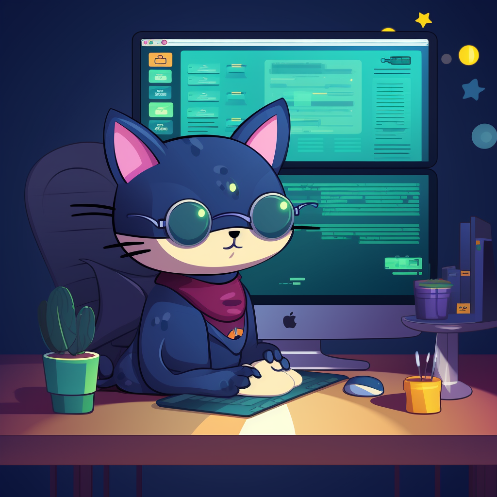

# Bonjour 👋, je suis Stéphane

Développeur web passionné et créatif, j'ai un parcours riche allant du développement Front-End à la maîtrise de frameworks JavaScript modernes. 
Je suis toujours en quête d'apprentissage et de nouvelles expériences pour offrir des expériences utilisateur exceptionnelles.

## En Bref

- 🔭 Je travaille actuellement sur [Argent Bank](https://github.com/Stephane-OC/Argent-Bank)
- 🌱 J'apprends : React, Redux, Redux Toolkit, Immer
- 🎓 Formation en cours : "Développeur d'application JavaScript React" (Diplôme Bac +4)
- 📫 Comment me joindre: [Mon profil LinkedIn](https://www.linkedin.com/in/stephane-f-431b0b214/)
- ⚡ Fun fact: J'ai créé des vidéos animées entièrement en web (HTML, CSS, JS) sans logiciel de montage professionnel !

## Projets dont je suis fier

### Vidéos d'anniversaire pour Cruella (2022) 

- [Intro](https://github.com/Stephane-OC/CruellaDk-Birthday-Intro) 🎥 [Voir la vidéo](https://www.youtube.com/watch?v=sJ8hM24kiMI)
- [Transitions](https://github.com/Stephane-OC/CruellaDk-Birthday-Transitions) 🎥 [Voir la vidéo](https://www.youtube.com/watch?v=P0LOIDXslWk)
- [Générique](https://github.com/Stephane-OC/CruellaDk-Birthday-Generic) 🎥 [Voir la vidéo](https://www.youtube.com/watch?v=jpUCKa0yNd0)

### Vidéos d'anniversaire pour Cruella (2023) 

- [Intro](https://github.com/Stephane-OC/Cruella-BB-2023_Intro) 🎥 [Voir la vidéo](https://www.youtube.com/watch?v=X9Zs112UhKc)
- [Messages](https://github.com/Stephane-OC/Cruella-BB-2023_Messages) 🎥 [Voir la vidéo](https://www.youtube.com/watch?v=X9Zs112UhKc&t=346s)
- [Générique](https://github.com/Stephane-OC/Cruella-BB-2023_Generic) 🎥 [Voir la vidéo](https://www.youtube.com/watch?v=X9Zs112UhKc&t=984s)

## Langages et Outils:

  
  
  
  
  
  
  
  

## Mes hobbies

- 🚶‍♂️ La marche
- 🎮 Jeux vidéos : Je suis un fan de "World Of Warcraft"

---

N'hésitez pas à consulter mes [projets sur GitHub](https://github.com/Stephane-OC) pour plus de détails sur mon travail et ma progression en tant que développeur.

